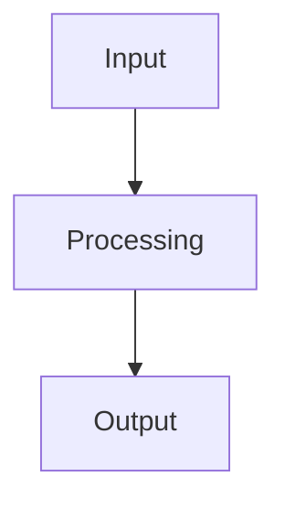

# 3. Computer Science Template (Systems + Logic + Implementation)

# <Course> — <Topic>

**Course Code:**  
**Date:**  
**Source:**  
**Tags:** #cs  

---

## Big Idea
> What problem does this concept solve?

---

## Core Concepts

### <Concept>
- Definition
- Purpose

---

## System / Process Flow



---

## Data Structures / Components

* Component 1
* Component 2

---

## Algorithm / Logic

### Pseudocode

```text
Step 1:
Step 2:
Step 3:
```

---

## Example Implementation

```python
# Example code
```

---

## Complexity / Performance

* Time complexity
* Space complexity

---

## Common Errors

* Logic errors
* Edge cases ignored
* Inefficient implementation

---

## Check Your Understanding

* Trace the algorithm
* Modify for ______
* Identify inefficiencies

---

## Connections

* [[Data Structures]]
* [[Algorithms]]

---

## Summary

* Problem solved
* Key approach
* Key trade-offs

