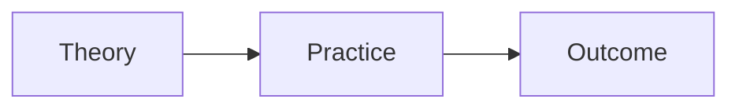

---

# 4. Education Template (Theory + Pedagogy + Practice)

# <Course> — <Topic>

**Course Code:**  
**Date:**  
**Source:**  
**Tags:** #education  

---

## Big Idea
> Core pedagogical principle

---

## Key Concepts

### <Concept>
- Definition
- Explanation

---

## Theoretical Framework

- Theory name  
- Key idea  
- Researcher (if applicable)

---

## Classroom Application

- Strategy 1  
- Strategy 2  
- Strategy 3  

---

## Concept Relationships

---

## Examples

* Classroom scenario
* Implementation example

---

## Common Misconceptions

* Misunderstanding ______
* Overgeneralizing ______

---

## Reflection

* How would I apply this?
* Strengths / limitations

---

## Check Your Understanding

* Explain ______
* Compare ______
* Apply to scenario

---

## Connections

* [[Assessment]]
* [[Curriculum Design]]

---

## Summary

* Core idea
* Application
* Teaching impact

