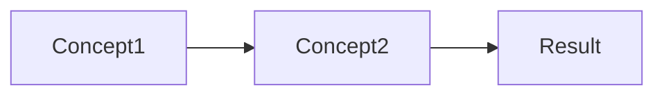

---

# 📁 2. Math Template (Structure + Abstraction + Practice)

# <Course> — <Topic>

**Course Code:**  
**Date:**  
**Source:**  
**Tags:** #math  

---

## Big Idea
> Underlying mathematical structure or pattern

---

## Definitions

### <Term>
- Formal definition

---

## Key Theorems / Rules

### <Theorem Name>
- Statement

**Conditions**
- When applicable

---

## Core Skills

- Skill 1  
- Skill 2  
- Skill 3  

---

## Concept Relationships

---

## Representations

* Algebraic form
* Graphical interpretation
* Numerical example

---

## Worked Examples

### Example 1

**Problem:**
**Solution:**
Step-by-step

---

## Common Errors

* Algebraic mistakes
* Misapplying formulas
* Ignoring domain restrictions

---

## Check Your Understanding

* Simplify ______
* Solve ______
* Explain why ______

---

## Connections

* [[Previous Topic]]
* [[Future Topic]]

---

## Summary

* Key rule
* Key structure
* Key application

---
