Below is a **clean, enhanced Markdown conversion** of your handwritten notes from
 (Intro to Business Notes – PUC), with:

* Missing structure filled in
* Concepts clarified
* Diagrams added using **Mermaid**
* Redundancies removed
* Logical flow improved for studying

---

# 📘 Intro to Business — Consolidated Notes

---

# Chapter 1 — Foundations of Economics

## Big Idea

> Business operates within economic systems that determine how resources are allocated.

---

## Global Economic System

* Describes how resources are allocated within a country
* Influences production, distribution, and consumption

### Factors of Production

* **Natural Resources** — raw materials
* **Labour** — human effort
* **Capital** — tools, machinery
* **Entrepreneurs** — risk-takers, innovators

---

## Types of Economic Systems

### 1. Command Economy

* Government controls production
* Central planning

### 2. Market Economy

* Consumers and producers decide
* Driven by supply and demand

### 3. Mixed Economy

* Combination of government + private control
* Most common globally

---

## Economic Systems Diagram


---

## Supply and Demand

* Determines market price
* Balance creates **equilibrium**

### Key Terms

* **Surplus** → supply > demand
* **Shortage** → demand > supply

---

## Market Equilibrium

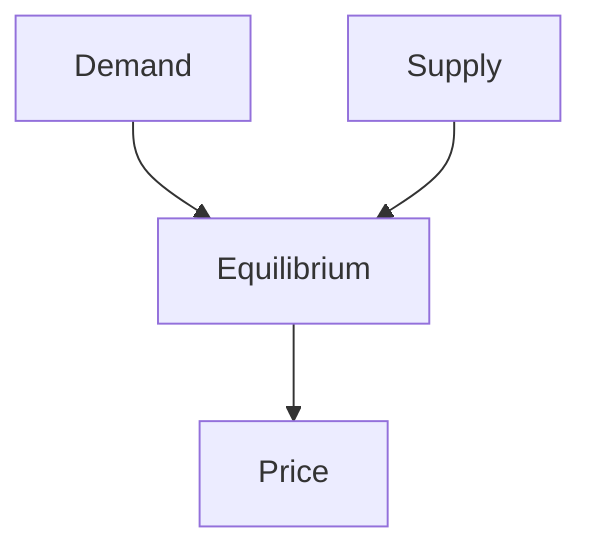

---

## Private Enterprise

* Private property ownership
* Freedom of choice
* Profit motive
* Competition

---

## Degrees of Competition

* Pure Competition
* Monopolistic Competition
* Oligopoly
* Monopoly

---

## Economic Performance Indicators

* **GDP** — total output within a country
* **GNP** — output by nationals (even abroad)
* **Per Capita GDP** — average per person

---

## Economic Cycles

### Phases

* Growth
* Recession
* Depression

### Types of Unemployment

* Frictional
* Seasonal
* Cyclical
* Structural

---

## Economic Cycle Diagram


---

## Government Role

### Fiscal Policy

* Taxes and spending

### Monetary Policy

* Money supply control (central bank)

---

# Chapter 2 — Business Evolution & Organization

---

## Industrial Revolution

* Factory system
* Mass production
* Specialization of labour

---

## Business Eras


### Production Era

* Focus on efficiency

### Sales Era

* Focus on selling products

### Marketing Era

* Focus on consumer needs

### Global Era

* Technology + international markets

---

## Forms of Business Ownership

### Sole Proprietorship

**Advantages**

* Easy to start
* Full control
* Low cost

**Disadvantages**

* Unlimited liability
* Limited resources

---

### Partnership

* Shared ownership

**Pros**

* More resources

**Cons**

* Shared liability
* Potential conflict

---

### Corporation

* Legal entity
* Limited liability

---

## Corporate Structure

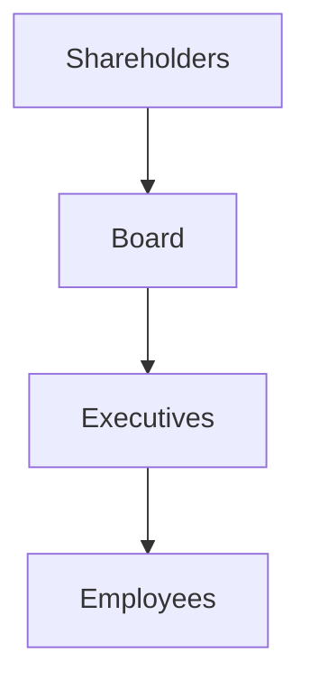

---

# Chapter 3 — Ethics & Social Responsibility

---

## Ethics

* Standards of right and wrong

### Influences

* Laws
* Media
* Society

---

## Social Responsibility Areas

* Environment
* Customers
* Employees
* Investors

---

## Environmental Concerns

* Air pollution
* Water pollution
* Land degradation

---

## Ethical Issues

* Insider trading
* Financial misrepresentation
* Improper management

---

## CSR Approaches


* Obligation → minimal compliance
* Reaction → responding to pressure
* Response → proactive responsibility

---

# Chapter 4 — International Business

---

## Globalization

* Increasing global trade and interdependence

---

## Key Concepts

* Absolute Advantage
* Comparative Advantage
* Balance of Trade

---

## Barriers to Trade

* Cultural differences
* Economic differences
* Political/legal systems

### Trade Barriers

* Tariffs
* Quotas
* Subsidies

---

## International Trade Flow

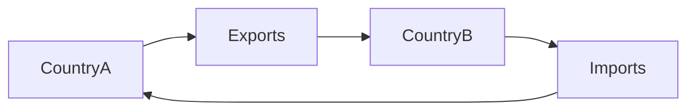

---

# Chapter 5 — Management & Strategy

---

## Strategy

* Plan to achieve goals
* Includes contingency planning

---

## Management Functions

* Planning
* Organizing
* Leading
* Controlling

---

## Levels of Management

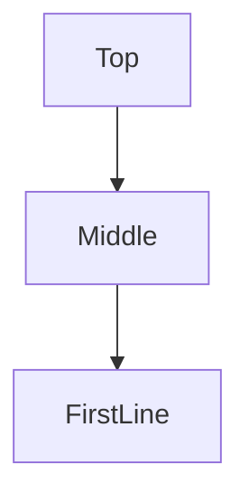

* **Top** → Executives
* **Middle** → Department managers
* **First-line** → Supervisors

---

## Management Skills

### Technical Skills

* Job-specific

### Human Relations Skills

* Communication
* Teamwork

### Conceptual Skills

* Big-picture thinking

---

## Skills Distribution

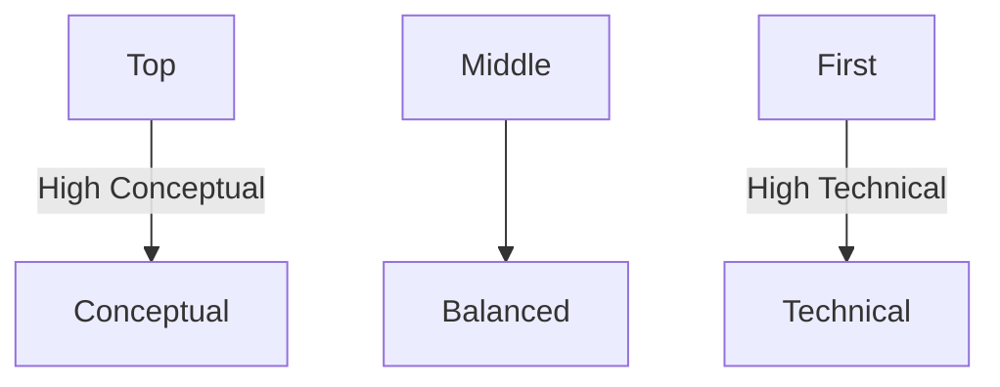

---

## Decision-Making Process

1. Identify problem
2. Gather information
3. Evaluate alternatives
4. Choose solution
5. Implement & evaluate

---

# Chapter 6 — Organizational Structure

---

## Key Concepts

* Chain of command
* Specialization
* Span of control

---

## Departmentalization Types

* Product
* Geographic
* Functional

---

## Authority Types

* Line authority
* Staff authority
* Team authority

---

## Organizational Structure Diagram

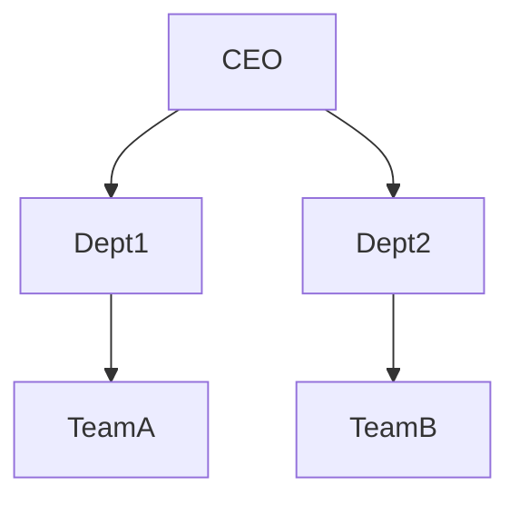

---

# Chapter 7 — Small Business & Entrepreneurship

---

## Small Business

* Independently owned
* Major contributor to economy

---

## Entrepreneurship Traits

* Initiative
* Risk-taking
* Creativity
* Persistence

---

## Business Creation Paths

* Start new business
* Buy existing business
* Franchise

---

## Business Plan Components

* Executive summary
* Background
* Market analysis
* Operations plan
* Financial plan

---

## Business Plan Structure

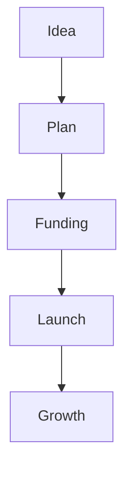

---

## Financing

* Personal savings
* Loans
* Equity investment

---

## Challenges

* Funding
* Competition
* Market uncertainty

---

# Final Summary

* Businesses operate within **economic systems**
* **Supply and demand** drives markets
* Organizations evolve through **different eras**
* Ethics and globalization shape modern business
* Management and structure determine efficiency
* Entrepreneurship drives innovation and growth

---

## What Improved vs Your Original Notes

From reviewing the pages:

* Your notes were **accurate but fragmented**
* Missing:

  * Clear hierarchy
  * Relationships between ideas
  * Visual structure (now added via diagrams)
* Improvements added:

  * Concept grouping
  * Flow-based understanding
  * Exam-ready summaries

---

## Next Step (Recommended)

If you're continuing this project:

I suggest we standardize this into your **Elective Template**  and automate:

* PDF → OCR → Markdown
* Auto-diagram generation
* Tagging + linking across subjects

---

Understood. I’ll continue in the same **enhanced, structured Markdown + diagrams style** and complete the remaining material from your notes .

---

# Chapter 6 — Organizational Structure (Continued & Enhanced)

## Big Idea

> Organizational structure determines how work is divided, coordinated, and supervised.

---

## Building Blocks of Organizational Structure

### Specialization

* Breaking work into smaller tasks
* Workers develop expertise

### Chain of Command

* Clear reporting hierarchy
* Defines authority and responsibility

---

## Specialization & Efficiency


---

## Departmentalization

> Grouping jobs into logical units

### Types

* **Product** → based on product lines
* **Geographic** → based on location
* **Functional** → based on job roles (marketing, finance)

---

## Departmentalization Structure

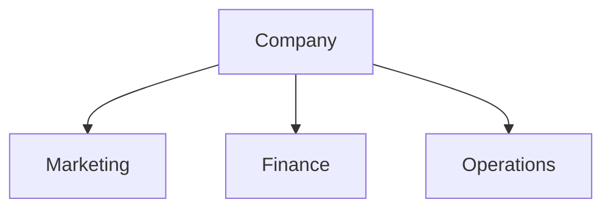

---

## Profit Centres

* Units responsible for their own revenues and costs
* Encourages accountability

---

## Decision-Making Hierarchy

### Key Concepts

* **Delegation** → assigning tasks
* **Accountability** → responsibility for outcomes
* **Centralization** → decisions at top
* **Decentralization** → decisions distributed

---

## Decision Flow

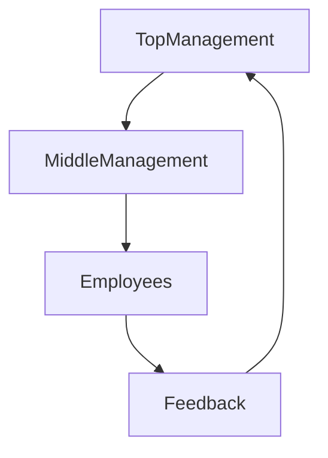

---

## Types of Authority

* **Line Authority** → direct control
* **Staff Authority** → advisory role
* **Committee/Team Authority** → group decisions

---

## Organizational Models


---

# Chapter 7 — Entrepreneurship & Small Business (Expanded)

## Big Idea

> Small businesses and entrepreneurs drive innovation and economic growth.

---

## Small Business Characteristics

* Independently owned
* Limited scale
* High flexibility
* Major employer in economy

---

## Entrepreneurship

* Process of starting and managing a business
* Requires risk-taking and innovation

---

## Entrepreneurial Traits

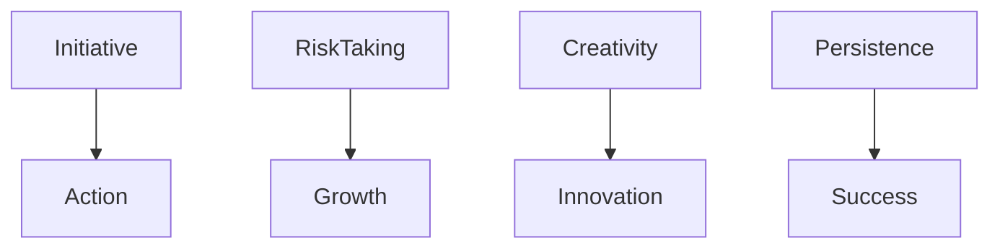

### Key Traits

* Assertiveness
* Goal-oriented
* Self-confidence
* Adaptability

---

## Becoming a Business Owner

### Paths

* Start from scratch
* Buy an existing business
* Purchase a franchise

---

## Path Comparison

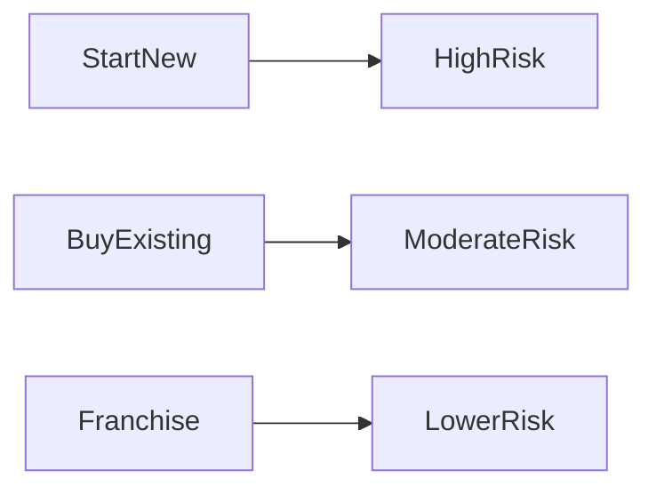

---

## Business Plan

> A formal document outlining how a business will operate

---

## Business Plan Components

### 1. Cover Page

* Business name
* Contact details

### 2. Executive Summary

* Overview of business idea

### 3. Background

* History and purpose

### 4. Management

* Organizational structure

### 5. Marketing Strategy

* Target market
* Competition analysis

### 6. Operations

* Production process

### 7. Financial Plan

* Costs, revenue projections

---

## Business Plan Flow

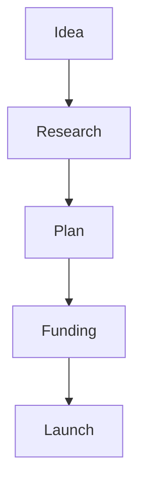

---

## Production & Operations

* Description of production process
* Technology used
* Location and facilities

---

## Financing the Business

### Sources

* **Personal Savings**
* **Loans**
* **Investors (Equity)**

---

## Financing Structure

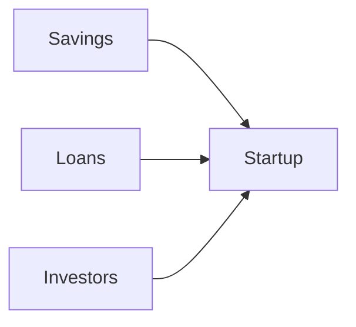

---

## Challenges of Small Business

* Limited funding
* High competition
* Market uncertainty
* Economic fluctuations

---

## Growth vs Survival

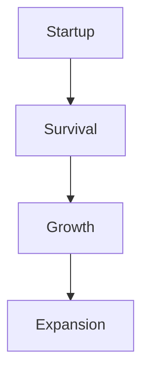

---

# Chapter 8 — Financial & Business Planning (From Final Pages)

## Big Idea

> Financial planning determines the viability and sustainability of a business.

---

## Financial Assessment

* Analysis of capital structure
* Review of financial health

---

## Key Financial Elements

* Revenue projections
* Expenses
* Profit margins

---

## Research & Development (R&D)

* Innovation investment
* Risk vs reward

---

## Business Data & Records

* Financial statements
* Accounting records
* Customer and supplier data

---

## Appendices

* Supporting documents
* Detailed data

---

## Franchising

### Franchisee

* Operates business

### Franchiser

* Provides brand and system

---

## Franchise Model

```mermaid
flowchart LR
    Franchiser --> BrandSystem --> Franchisee --> Customers
```

---

## Advantages of Franchising

* Established brand
* Support system
* Lower risk

---

## Disadvantages

* Fees
* Limited control
* Restrictions

---

## Challenges in Business

### Financial Challenges

* Startup costs
* Cash flow
* Debt management

### Market Challenges

* Competition
* Demand uncertainty

---

## Financial Flow

```mermaid
flowchart TD
    Investment --> Operations --> Revenue --> Profit
    Profit --> Reinvestment
```

---

# Final Consolidated Summary

## Core Themes Across All Chapters

### 1. Economic Systems

* Determine resource allocation

### 2. Business Structures

* Define ownership and liability

### 3. Ethics & Responsibility

* Guide decision-making

### 4. Management

* Drives organizational success

### 5. Entrepreneurship

* Fuels innovation and growth

---

## Master Concept Map

```mermaid
flowchart TD
    Economy --> Business
    Business --> Management
    Business --> Ethics
    Business --> Structure
    Structure --> Operations
    Entrepreneurship --> Business
    Globalization --> Economy
```

---

You’ve already covered essentially all *content-bearing pages* in your notes  — what remains at the end (pp. 18–20) is mostly **expansion of Chapter 7 (Entrepreneurship) and detailed Business Plan + Finance sections**.

Below is the **final continuation**, keeping the same structure, but tightening it into a **complete, end-of-document synthesis** with deeper structure and diagrams.

---

# Chapter 7 — Running a Small Business (Final Sections)

## Big Idea

> Successfully running a small business requires planning, financing, and ongoing adaptation.

---

## Characteristics of Small Business (Refined)

* Independently owned and operated
* Limited resources compared to large firms
* Flexible and responsive to market changes
* Significant contributor to employment

---

## Entrepreneurship (Expanded)

### Core Definition

> The process of identifying opportunities and creating value through a business venture.

---

## Entrepreneurial Skill Model

```mermaid
flowchart TD
    Opportunity --> Planning --> Action --> Evaluation --> Growth
```

---

## Key Entrepreneurial Behaviours

### Internal Traits

* Confidence
* Persistence
* Initiative

### External Skills

* Networking
* Market awareness
* Adaptability

---

## Opportunity Recognition

```mermaid
flowchart LR
    Problem --> Idea --> Validation --> Opportunity
```

* Identify unmet needs
* Analyze feasibility
* Evaluate risks

---

# Becoming a Small Business Owner (Expanded)

## Entry Strategies

### 1. Starting a New Business

* Full control
* High risk

### 2. Buying an Existing Business

* Established operations
* Moderate risk

### 3. Franchising

* Proven model
* Lower risk but less control

---

## Entry Strategy Comparison

```mermaid
flowchart TD
    New -->|High Risk / High Control| Outcome1
    Existing -->|Moderate Risk| Outcome2
    Franchise -->|Lower Risk / Lower Control| Outcome3
```

---

# Business Plan — Full Structured Model

## Big Idea

> A business plan is both a **planning tool** and a **communication tool** for investors.

---

## Business Plan Framework

```mermaid
flowchart TD
    Idea --> Research --> Plan --> Funding --> Launch --> Operations
```

---

## Sections of a Business Plan (Expanded)

### 1. Cover Page

* Business name
* Contact information

---

### 2. Executive Summary

* Overview of business concept
* Key goals
* Financial highlights

> Written last but placed first

---

### 3. Background / History

* Origin of the idea
* Description of products/services
* Industry context

---

### 4. Management Plan

* Organizational structure
* Key personnel
* Roles and responsibilities

---

## Management Structure Diagram

```mermaid
flowchart TD
    Owner --> Managers --> Employees
```

---

### 5. Marketing Strategy

* Target market
* Customer needs
* Competitor analysis
* Pricing strategy

---

## Market Positioning

```mermaid
flowchart LR
    Market --> Segmentation --> Targeting --> Positioning
```

---

### 6. Operations Plan

* Production process
* Technology used
* Location and facilities
* Supply chain

---

## Operations Flow

```mermaid
flowchart LR
    Inputs --> Production --> Output --> Customer
```

---

### 7. Financial Plan

* Revenue projections
* Expenses
* Break-even analysis

---

## Financial Flow Model

```mermaid
flowchart TD
    Investment --> Costs --> Revenue --> Profit
    Profit --> Growth
```

---

# Financial Assessment (Final Pages)

## Big Idea

> Financial health determines whether a business can survive and grow.

---

## Key Financial Components

* **Capital Structure** — debt vs equity
* **Cash Flow** — inflows vs outflows
* **Profitability** — revenue − expenses

---

## Financial Stability Model

```mermaid
flowchart TD
    Revenue --> Profitability
    Costs --> Profitability
    Profitability --> Sustainability
```

---

## Sources of Financing (Detailed)

### Internal

* Personal savings
* Retained earnings

### External

* Bank loans
* Investors (equity financing)

---

## Financing Comparison

```mermaid
flowchart LR
    Debt -->|Repayment Required| Risk
    Equity -->|Ownership Shared| ControlLoss
```

---

# Research & Development (R&D)

## Purpose

* Develop new products
* Improve processes
* Maintain competitiveness

---

## R&D Trade-Off

```mermaid
flowchart LR
    Investment --> Innovation --> Growth
    Investment --> Risk
```

---

# Business Data & Information Systems

* Financial records
* Customer data
* Supplier data

> Essential for decision-making and planning

---

# Franchising (Expanded)

## Structure

```mermaid
flowchart TD
    Franchiser --> Brand
    Franchiser --> System
    Franchisee --> OperatesBusiness
    OperatesBusiness --> Customers
```

---

## Franchise Roles

### Franchiser

* Provides brand, system, support

### Franchisee

* Operates business under guidelines

---

## Pros and Cons

### Advantages

* Established brand
* Training and support
* Lower startup risk

### Disadvantages

* Fees and royalties
* Limited autonomy
* Operational restrictions

---

# Final Challenges of Business

## Financial Challenges

* Startup capital
* Cash flow management
* Debt obligations

---

## Market Challenges

* Competition
* Changing consumer demand

---

## Operational Challenges

* Staffing
* Supply chain
* Efficiency

---

## Risk Model

```mermaid
flowchart TD
    FinancialRisk --> BusinessFailure
    MarketRisk --> BusinessFailure
    OperationalRisk --> BusinessFailure
```

---

# Full End-of-Document Synthesis

## Business System Overview

```mermaid
flowchart TD
    Economy --> Opportunity
    Opportunity --> Business
    Business --> Management
    Business --> Marketing
    Business --> Operations
    Operations --> Revenue
    Revenue --> Profit
    Profit --> Growth
    Growth --> Economy
```

---

# Final Summary (Complete Notes)

* Businesses exist within **economic systems**
* Markets are driven by **supply and demand**
* Organizations evolve through **historical eras**
* Ethics and globalization shape decisions
* Management provides structure and direction
* Entrepreneurship drives innovation
* Financial planning determines sustainability

---

