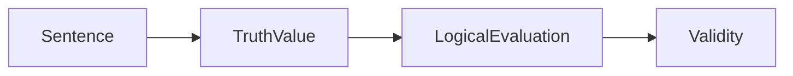
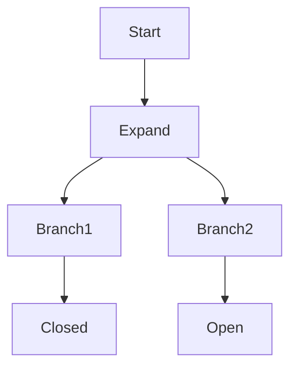
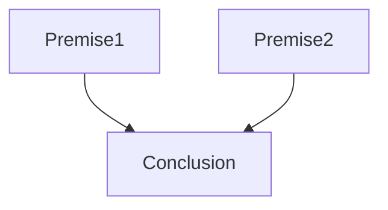
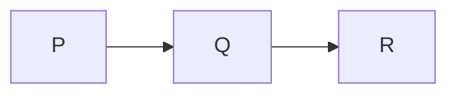
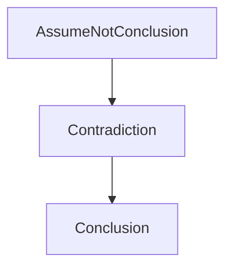
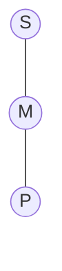
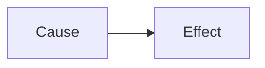
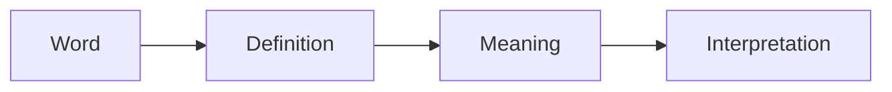

# PHIL340 — Logic & Linguistic Analysis

**Course Code:** PHIL340
**Source:** Handwritten Notes
**Tags:** #logic #philosophy #symbolic_logic

---

## Big Idea

> Logic analyzes the structure of reasoning to determine truth, validity, and soundness of arguments.

---

## 1. Semantics & Declarative Sentences

### Declarative Sentences

* Statements that can be assigned a **truth value**

  * True $T$
  * False $F$

---

## Laws of Thought

1. **Law of Identity**

   * $P \equiv P$

2. **Law of Non-Contradiction**

   * $\neg (P \land \neg P)$

3. **Law of Excluded Middle**

   * $P \lor \neg P$

---

## Concept Relationships

---

## 2. Truth Functions & Connectives

### Logical Operators

| Operator      | Symbol | Meaning     |
| ------------- | ------ | ----------- |
| Negation      | ¬P     | not P       |
| Conjunction   | P ∧ Q  | P and Q     |
| Disjunction   | P ∨ Q  | P or Q      |
| Conditional   | P → Q  | if P then Q |
| Biconditional | P ↔ Q  | P iff Q     |

---

## Truth Functional Classification

* **Tautology $T$** → always true
* **Contradiction $F$** → always false
* **Contingent $I$** → depends on truth assignment

---

## Key Truth Rule

* Conditional $P \rightarrow Q$ is false **only when**:

  * $P = T$, $Q = F$

---

## Truth Tables

Used to determine:

* Validity
* Equivalence
* Consistency

---

## 3. Truth Trees (Semantic Tableaux) ⚠️ *Added*

### Purpose

* Test **validity**
* Test **consistency**

---

### Method

1. Start with:

   * Premises
   * Negation of conclusion (for validity)

2. Break statements into components

3. Analyze branches:

   * Closed branch → contradiction
   * Open branch → possible truth assignment

---

### Diagram

---

### Interpretation

* All branches closed → **Valid**
* At least one open branch → **Invalid**

---

## 4. Arguments

### Definition

* A set of **premises** supporting a **conclusion**

---

### Validity

An argument is **valid** if:

$$
(P_1 \land P_2 \land \dots \land P_n) \rightarrow C
$$

* If premises are true → conclusion must be true

---

## Argument Structure

---

## 5. Syllogisms

### Conditional Syllogisms

#### Modus Ponens

* $P \rightarrow Q$
* $P$
* ∴ $Q$

---

#### Modus Tollens

* $P \rightarrow Q$
* $\neg Q$
* ∴ $\neg P$

---

### Disjunctive Syllogism

* $P \lor Q$
* $\neg P$
* ∴ $Q$

---

### Hypothetical Syllogism

* $P \rightarrow Q$
* $Q \rightarrow R$
* ∴ $P \rightarrow R$

---

## Logical Flow

---

## 6. Rules of Inference

* Constructive Dilemma
* Absorption
* Simplification
* Conjunction
* Addition

---

### Example

* $P \land Q \Rightarrow P$

---

## 7. Partial Truth Tables ⚠️ *Refined*

### Strategy

1. Force the **conclusion to be false**
2. Try to make all premises true
3. If successful → **invalid**

> A single counterexample disproves validity

---

## 8. Replacement Rules

### DeMorgan’s Laws

* $\neg (P \land Q) \equiv \neg P \lor \neg Q$
* $\neg (P \lor Q) \equiv \neg P \land \neg Q$

---

### Transposition

* $P \rightarrow Q \equiv \neg Q \rightarrow \neg P$

---

### Material Implication

* $P \rightarrow Q \equiv \neg P \lor Q$

---

### Strategy

1. Identify structure
2. Apply equivalence
3. Preserve meaning

---

## 9. Testing Logical Statements

| Test Type   | Purpose                        |
| ----------- | ------------------------------ |
| Consistency | Can all be true together?      |
| Equivalence | Same truth values?             |
| Implication | Premises guarantee conclusion? |

---

## 10. Proof Methods

### Conditional Proof

* Assume antecedent
* Derive consequent

---

### Indirect Proof (Reductio)

* Assume opposite
* Derive contradiction

---

---

## 11. Categorical Logic

### Terms

* **Major term** → predicate of conclusion
* **Minor term** → subject of conclusion
* **Middle term** → links premises

---

## Standard Forms

| Type | Form             | Meaning                |
| ---- | ---------------- | ---------------------- |
| A    | All S are P      | Universal affirmative  |
| E    | No S are P       | Universal negative     |
| I    | Some S are P     | Particular affirmative |
| O    | Some S are not P | Particular negative    |

---

## Distribution Rules

* Universal → distributed
* Particular → not distributed

---

## Mood & Figure ⚠️ *Added*

### Mood

* Pattern of propositions (AAA, EAE, etc.)

---

### Figures

| Figure | Structure |
| ------ | --------- |
| 1      | M–P, S–M  |
| 2      | P–M, S–M  |
| 3      | M–P, M–S  |
| 4      | P–M, M–S  |

---

## Venn Diagram Method

---

## Common Fallacies (Categorical)

* Four terms
* Undistributed middle
* Illicit major/minor
* Exclusive premises

---

## 12. Predicate Logic

### Quantifiers

* Universal: $\forall x$
* Existential: $\exists x$

---

## Translation Insight ⚠️ *Added*

* Universal:

  * $\forall x (P(x) \rightarrow Q(x))$

* Existential:

  * $\exists x (P(x) \land Q(x))$

---

## Rules

* Universal Instantiation (UI)
* Existential Generalization (EG)

---

## 13. Causation

### Necessary vs Sufficient

* Sufficient:

  * $A \rightarrow B$

* Necessary:

  * $B \rightarrow A$

---

## Five Methods

1. Agreement
2. Difference
3. Joint
4. Residues
5. Concomitant Variation

---

---

## 14. Semantics (Meaning)

### Definitions

* **Definiens** → defining phrase
* **Definiendum** → term defined

---

## Types of Definitions

* Lexical
* Stipulative
* Precising

---

## Concept Relationships

---

## 15. Informal Fallacies

1. Ad Ignorantiam
2. Ad Verecundiam
3. Ad Hominem
4. Ad Populum
5. Ad Misericordiam
6. Ad Baculum
7. Ignoratio Elenchi
8. Complex Question
9. Petitio Principii
10. Equivocation

---

## Summary

* Logic evaluates **truth and validity**
* Arguments rely on **formal structure**
* Truth tables and trees provide **systematic testing**
* Categorical and predicate logic extend reasoning
* Fallacies identify **errors in reasoning**

---

## If You Continue This Project

Next logical enhancements:

* Add **worked examples per section**
* Add **exam-style problems**
* Auto-generate:

  * Truth tables
  * Trees
  * Venn diagrams

